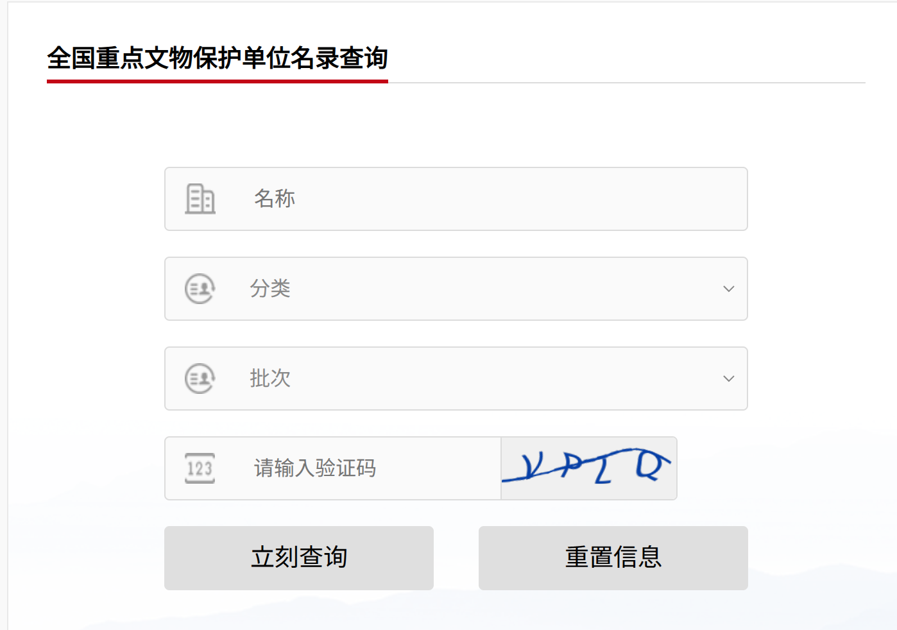
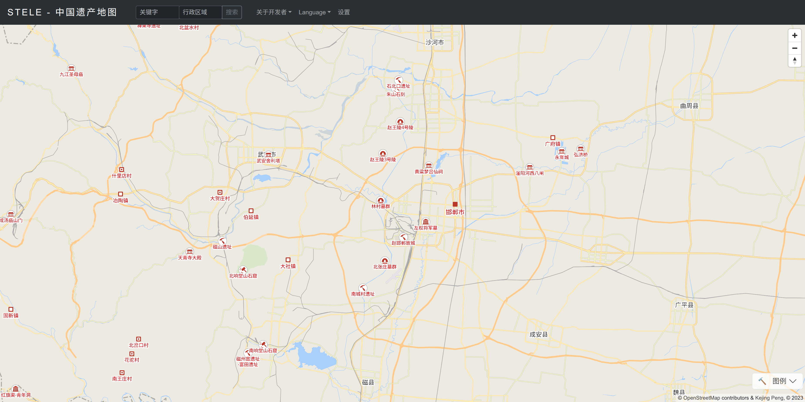
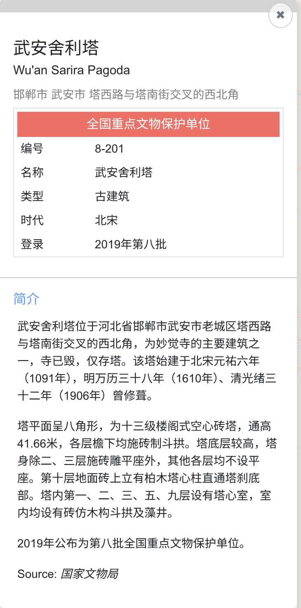

# 项目灵感

## 动机

我是一名中国历史爱好者，当我游览一座城市时，我希望能够深入了解一些发生在当地的重要历史事件，这时一个重要的途径就是去查询当地有哪些**全国重点文物保护单位**和省市级的文物保护单位。其中有一些是人尽皆知的著名景点，比如北京的故宫、西安的秦兵马俑，但有很多则相对冷门很多，比如我去过以下这些冷门的保护单位：

- 广州的南汉二陵博物馆
- 上海的元代水闸遗址博物馆
- 杭州的吴越国王陵考古遗址公园
- 保定的贤怡亲王墓
- 北京的西周燕都博物馆（可惜不对外开放，吃了闭门羹）

现在每到一个地方，我都要自己搜索当地的文保单位，找出其中感兴趣的深入研究，然后做旅游规划。完成游览之后，我只能在高德地图上点个收藏，当时拍的照片、游览时的感想没有集中的记录。我希望能做一个工具，让我的文保单位之旅计划起来更容易，而且有更自动化、系统化的记录。

## 主要功能

长远的目标是支持全国重点文物保护单位、省市级重点文物保护单位、世界自然遗产、世界文化遗产等各种名录的信息展示和旅游规划，第一期我们先完成全国重点文物保护单位的覆盖（也有5000多个了，大工程）。以下功能并非详细的产品设计，只是一些必要的功能和产品灵感。

### 信息展示

- 全局信息：在地图上展示一批文保单位的位置，标准的地图展示，可以缩放、拖拽
- 单个信息：点击一个文保单位，显示其详细信息，核心信息包括
  - 时代
  - 文保单位类型
  - 相关人物、历史事件等背景
  - 照片（基于网络检索展示）
  - 景点情况：是否开放、门票价格等，展示高德、大众点评等平台的评分和评价
  - 聊天界面：支持用户追问信息

### 信息搜索

- 基于自然语言的搜索，背后要利用大模型、向量检索等能力提高检索的自由度，可能的query：
  - 河南省郑州市魏晋南北朝时期的景点
  - 西安市跟李世民有关的景点
  - 跟红山文化同时期的所有文化遗址

### 旅行规划

- 结合时间、地点、历史旅行记录和兴趣点，推荐行程

### 个性化记录

- 针对每个用户的个性化记录：
  - 是否去过
  - 是否想去、想二刷
  - 照片、文字记录
- 成就系统：去过河北省X个景点中的Y个，支持分享、排行榜等

## 实现方式

### 产品形态

- Demo阶段：可以基于一个网站，基于现代的react + nextjs + supabase 技术栈
- 进阶阶段：做一个微信小程序。只做小程序，不考虑APP

### 功能实现路径

- 第一阶段：信息展示
- 第二阶段：自然语言检索展示和对话
- 第三阶段：个性化记录和成就系统
- 第四阶段：旅行规划

## 参考资料

- [Wikipedia的全国重点文物保护单位介绍](https://zh.wikipedia.org/wiki/%E5%85%A8%E5%9B%BD%E9%87%8D%E7%82%B9%E6%96%87%E7%89%A9%E4%BF%9D%E6%8A%A4%E5%8D%95%E4%BD%8D) 可以从中链接到历史上几批全国重点文保单位公布时的原始通知
- [国家文物局的文保单位查询页面](https://app.gjzwfw.gov.cn/jmopen/webapp/html5/gjwwjqgzdwwbhdwmlcx/index.html) 可以按批次、名称、类别查询文保单位列表。需要输验证码，但应该很容易hack.
  
  - 这个查询页面有很严重的BUG！！！n页和n+1页的查询结果10个里有9个是重复的（大概是因为每页的index+10写成了+1），导致无法获取到完整的结果，放弃。
- [中国遗产地图](http://stele.geogv.org/zhcn/) 这个项目实现了一部分我要的效果：把所有的文保单位画在了地图上，可以按关键词和行政区搜索，点进去有精确的地理位置和文保单位一些基本信息。但这个项目做得比较早了，它距离我想要的完整工具还差很多：
  
  - 搜索不智能：比如用“唐太宗”可以搜到一些单位，但用“李世民”则没有搜索结果。应该是简单的关键词匹配，没有利用现代NLP模型
  - 信息简略：关于文保单位只有最基本的信息，没有联网搜索、没有基于大模型能力的交互和提问
    
  - 无个性化记录：没有我想要的个性化记录功能，比如去过、想去、评分、添加照片等
